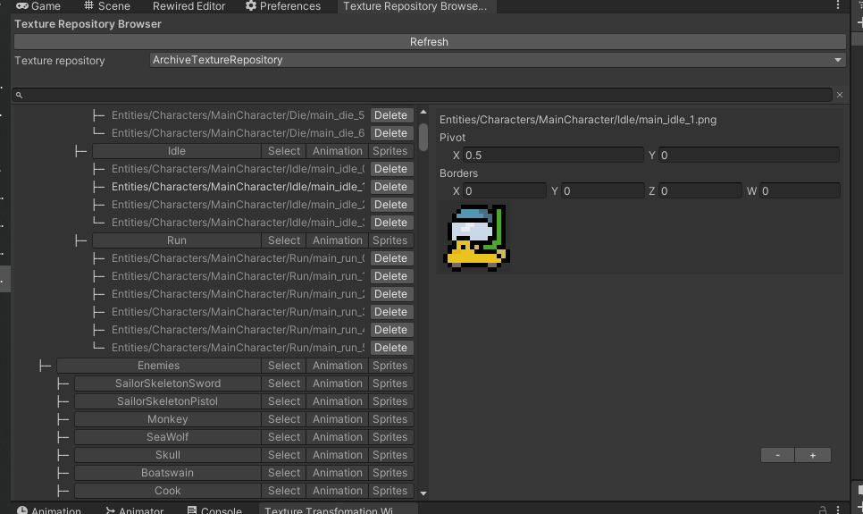

# SimpleTexturePacker
Simple [Texture Packer](https://www.codeandweb.com/texturepacker) importer tool for Unity. Imports generated Texture and JSon data, parses and structures it. 

 

#Supported parameters (some are paid)
* extrude
* algorithm
* trim-mode
* png-opt-level
* shape-padding
* disable-auto-alias
